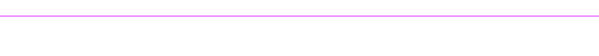

  

    
          💻 Atuo como Desenvolvedor Front-end 
          📱 Estudando UI/UX Designer         
          🎓 Cursando Sistemas de Informação  
          😁 Não possuo redes sociais         
     

 

  

   

  

